# SHREC 2020 — Cryo-ET Analysis Results

> Exploratory analysis and preprocessing pipeline for the **SHREC 2020 Cryo-Electron Tomography** dataset.  
> 10 simulated tomograms · 12 analysis steps · No ML training.

---

## Comparison Panels

Each model visualised across four preprocessing stages in a single figure.


> `figures_summary/comparison_panels/model_<N>_panel.png` — Original · Normalized · Denoised · CLAHE

---

## Slice Visualizations

Central and random orthogonal slices (XY / XZ / YZ) extracted from three volume types.

| Grandmodel (noisy) | Reconstruction | Noise-Free |
|---|---|---|
| 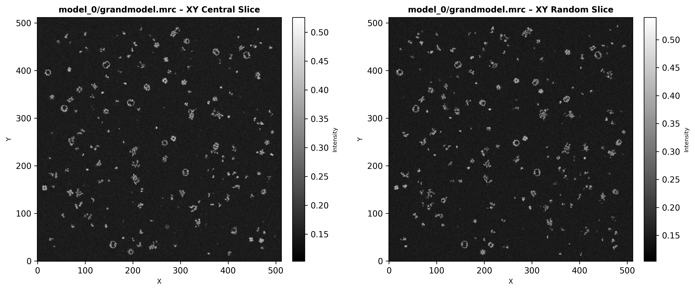 | 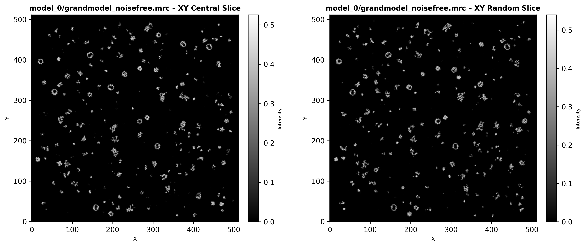 | 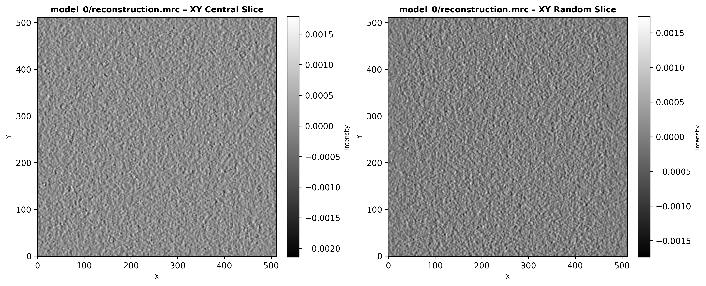 |

> `slice_visualizations/{grandmodel,reconstruction,noisefree}/model_<N>_{XY,XZ,YZ}.png`

---

## Noise Analysis

Pixel-wise comparison of the noisy grandmodel against the clean ground truth.


> **Left → Right:** Noisy slice · Noise-free slice · Difference map (RdBu)

| Intensity Histograms | SNR (dB) |
|---|---|
| 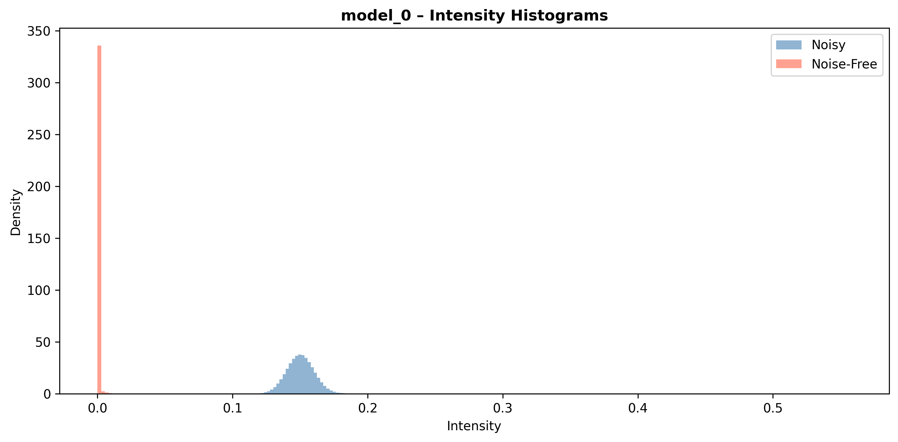 | 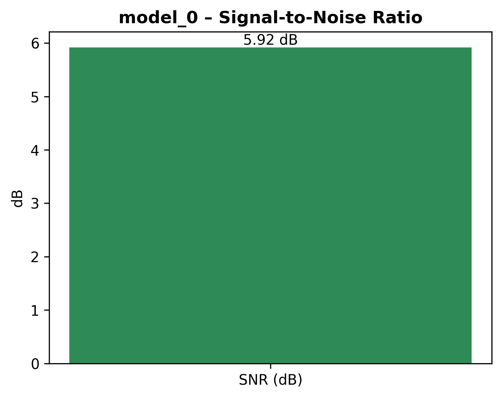 |

> `noise_analysis/before_after_noise/` · `noise_analysis/noise_histograms/`

---

## Projection Analysis

41-tilt series spanning −60° to +60°.

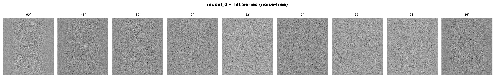


> **Strip:** 9 evenly-spaced noise-free projections · **Before/After:** Clean · Microscope · Difference at 0°

| Tilt Angle vs Index | Variance vs Tilt Angle |
|---|---|
| 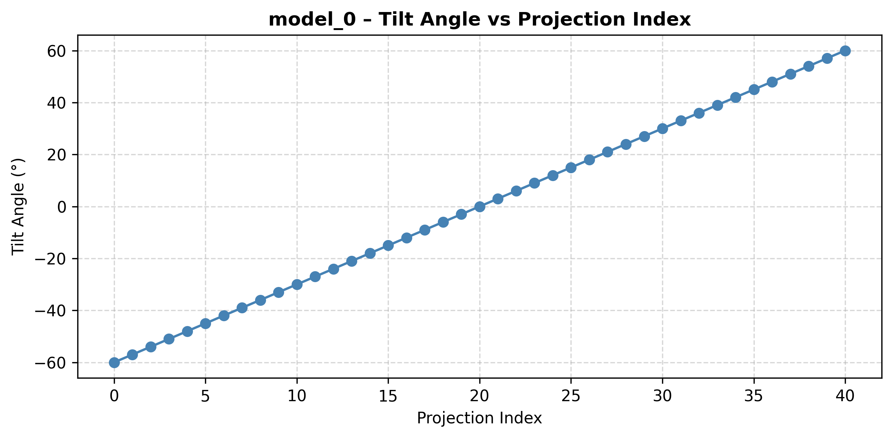 | 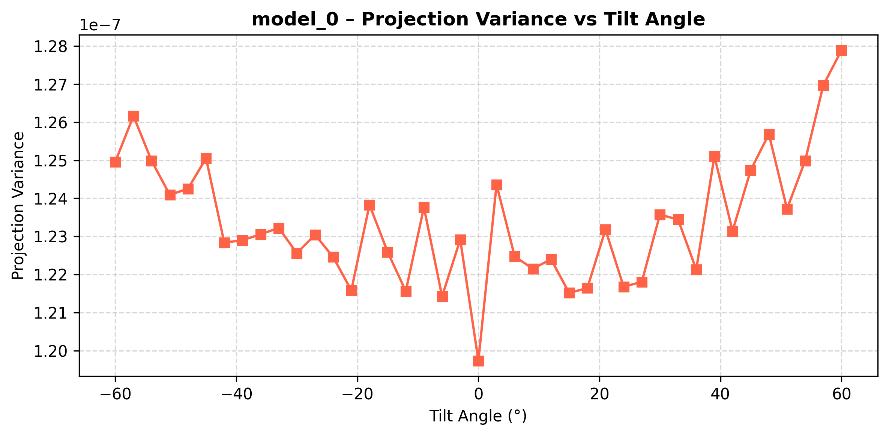 |

> `projection_analysis/tilt_series_visualization/` · `projection_analysis/before_after_projection/`

---

## Reconstruction Analysis

FBP reconstruction vs noise-free ground truth.


> **Left → Right:** Ground truth · Reconstructed slice · Difference map

| Slice Variance along Z | Intensity Histograms |
|---|---|
| 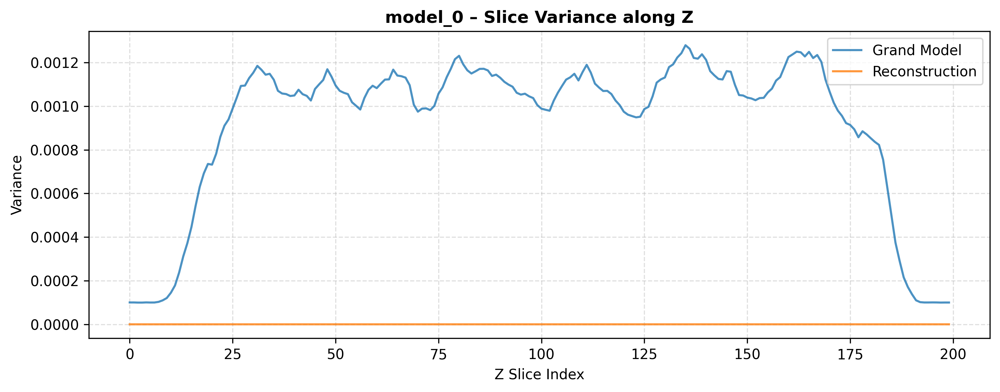 | 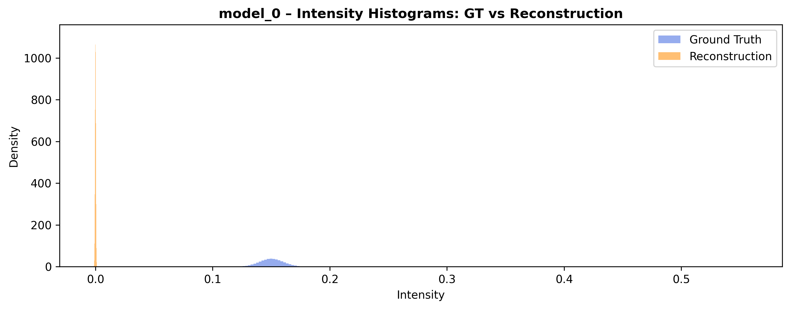 |

> `reconstruction_analysis/reconstruction_vs_groundtruth/` · `reconstruction_analysis/slice_variance_plots/`

---

## Preprocessing

All panels follow the format: **Original · Processed · Difference Map**

### Normalization

| Min-Max | Z-Score |
|---|---|
| 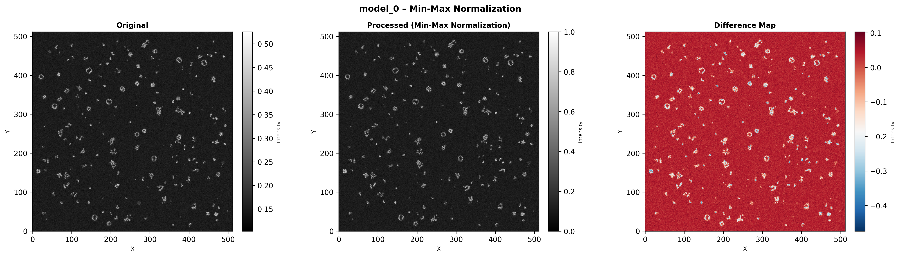 | 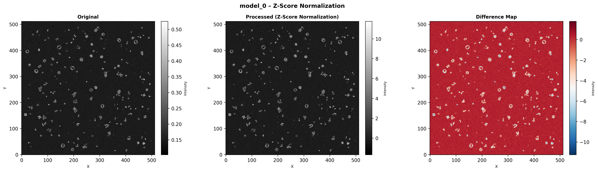 |

### Denoising

| Gaussian (σ = 1.5) | Median (3 × 3) |
|---|---|
| 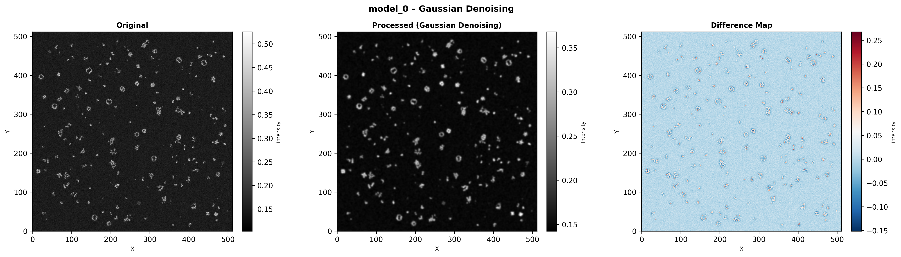 |  |

### Contrast Enhancement

| Histogram Equalization | CLAHE |
|---|---|
|  |  |

> `preprocessing/{normalization,denoising,contrast_enhancement}/`

---

## Mask Visualization

Class segmentation masks and occupancy bounding boxes overlaid on the raw tomogram slice.

| Class Mask Overlay | BBox Overlay |
|---|---|
| 

> `figures_summary/comparison_panels/model_<N>_panel.png` — Original · Normalized · Denoised · CLAHE

---

## Slice Visualizations

Central and random orthogonal slices (XY / XZ / YZ) extracted from three volume types.

| Grandmodel (noisy) | Reconstruction | Noise-Free |
|---|---|---|
|  |  |  |

> `slice_visualizations/{grandmodel,reconstruction,noisefree}/model_<N>_{XY,XZ,YZ}.png`

---

## Noise Analysis

Pixel-wise comparison of the noisy grandmodel against the clean ground truth.


> **Left → Right:** Noisy slice · Noise-free slice · Difference map (RdBu)

| Intensity Histograms | SNR (dB) |
|---|---|
|  |  |

> `noise_analysis/before_after_noise/` · `noise_analysis/noise_histograms/`

---

## Projection Analysis

41-tilt series spanning −60° to +60°.


> **Strip:** 9 evenly-spaced noise-free projections · **Before/After:** Clean · Microscope · Difference at 0°

| Tilt Angle vs Index | Variance vs Tilt Angle |
|---|---|
|  |  |

> `projection_analysis/tilt_series_visualization/` · `projection_analysis/before_after_projection/`

---

## Reconstruction Analysis

FBP reconstruction vs noise-free ground truth.


> **Left → Right:** Ground truth · Reconstructed slice · Difference map

| Slice Variance along Z | Intensity Histograms |
|---|---|
|  |  |

> `reconstruction_analysis/reconstruction_vs_groundtruth/` · `reconstruction_analysis/slice_variance_plots/`

---

## Preprocessing

All panels follow the format: **Original · Processed · Difference Map**

### Normalization

| Min-Max | Z-Score |
|---|---|
|  |  |

### Denoising

| Gaussian (σ = 1.5) | Median (3 × 3) |
|---|---|
|  |  |

### Contrast Enhancement

| Histogram Equalization | CLAHE |
|---|---|
|  |  |

> `preprocessing/{normalization,denoising,contrast_enhancement}/`

---

## Mask Visualization

Class segmentation masks and occupancy bounding boxes overlaid on the raw tomogram slice.

| Class Mask Overlay | BBox Overlay |
|---|---|
| 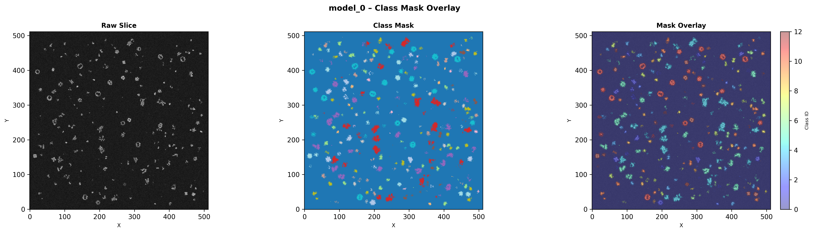 | 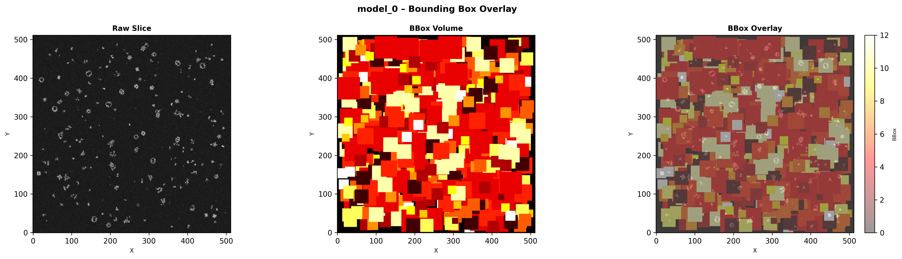 |

> **Each panel:** Raw slice · Mask / BBox volume · Semi-transparent overlay  
> `mask_visualization/class_mask_overlay/` · `mask_visualization/bbox_overlay/`

---

## Dataset Summary

| File | Content |
|------|---------|
| [`dataset_structure.txt`](dataset_summary/dataset_structure.txt) | Folder tree, file sizes (MB), missing file report for all 10 models |
| [`volume_statistics.csv`](dataset_summary/volume_statistics.csv) | Shape · mean · std · min · max · voxel count — 9 volumes × 10 models |

---

## Subtomograms

32 × 32 × 32 voxel cubes extracted around every particle coordinate.

```
subtomograms/
├── extracted_particles/      # .npy arrays — first 20 particles per model
└── subtomogram_examples/     # 3-row figures: full slice + marker / cube XY / zoom
```

```python
import numpy as np
cube = np.load("subtomograms/extracted_particles/model_0_sub_0000.npy")
# shape: (32, 32, 32), dtype: float32
```

---

## Full Results Structure

```
results/
├── dataset_summary/
│   ├── dataset_structure.txt
│   └── volume_statistics.csv
├── figures_summary/
│   └── comparison_panels/          # model_<N>_panel.png  ×10
├── mask_visualization/
│   ├── bbox_overlay/               # model_<N>_bbox_overlay.png  ×10
│   └── class_mask_overlay/         # model_<N>_mask_overlay.png  ×10
├── noise_analysis/
│   ├── before_after_noise/         # model_<N>_before_after.png  ×10
│   └── noise_histograms/           # model_<N>_{histograms,snr}.png  ×10
├── particle_analysis/
│   ├── particle_distribution/      # all_particle_locations.csv
│   ├── particle_histograms/        # model_<N>_class_counts.png  ×10
│   └── particle_3d_scatter/        # model_<N>_scatter_{XY,XZ,3D}.png  ×10
├── preprocessing/
│   ├── contrast_enhancement/       # model_<N>_{clahe,histogram_equalization}.png  ×10
│   ├── denoising/                  # model_<N>_{gaussian,median}_denoising.png  ×10
│   └── normalization/              # model_<N>_{min-max,z-score}_normalization.png  ×10
├── projection_analysis/
│   ├── before_after_projection/    # model_<N>_before_after.png  ×10
│   └── tilt_series_visualization/  # model_<N>_{tilt_series,tilt_angles,variance_vs_tilt}.png  ×10
├── reconstruction_analysis/
│   ├── reconstruction_vs_groundtruth/  # model_<N>_comparison.png  ×10
│   └── slice_variance_plots/           # model_<N>_{variance_z,intensity_hist}.png  ×10
├── slice_visualizations/
│   ├── grandmodel/                 # model_<N>_{XY,XZ,YZ}.png  ×10
│   ├── noisefree/                  # model_<N>_{XY,XZ,YZ}.png  ×10
│   └── reconstruction/             # model_<N>_{XY,XZ,YZ}.png  ×10
└── subtomograms/
    ├── extracted_particles/        # model_<N>_sub_<XXXX>.npy
    └── subtomogram_examples/       # model_<N>_class<C>_examples.png
```

## Dataset Summary

| File | Content |
|------|---------|
| [`dataset_structure.txt`](dataset_summary/dataset_structure.txt) | Folder tree, file sizes (MB), missing file report for all 10 models |
| [`volume_statistics.csv`](dataset_summary/volume_statistics.csv) | Shape · mean · std · min · max · voxel count — 9 volumes × 10 models |

---

## Subtomograms

32 × 32 × 32 voxel cubes extracted around every particle coordinate.

```
subtomograms/
├── extracted_particles/      # .npy arrays — first 20 particles per model
└── subtomogram_examples/     # 3-row figures: full slice + marker / cube XY / zoom
```

import numpy as np
cube = np.load("subtomograms/extracted_particles/model_0_sub_0000.npy")
# shape: (32, 32, 32), dtype: float32

---
